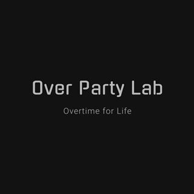

<div align="center">

# Over Party Lab Chatbot



**An intelligent LINE chatbot for cocktail discovery and recommendations**

[](https://opensource.org/licenses/MIT)
[](https://www.typescriptlang.org/)
[](https://developers.google.com/apps-script)
[](https://developers.line.biz/)

[Features](#features) • [Quick Start](#quick-start) • [Documentation](#installation) • [Contributing](#contributing)

</div>

---

## Overview

Over Party Lab Chatbot is a production-ready LINE messaging bot built for [Over Party Lab](https://www.instagram.com/over.party.lab/), leveraging Google Apps Script and TypeScript to deliver an interactive cocktail discovery experience. The bot intelligently searches cocktail recipes and provides personalized recommendations based on ingredients.

## Features

### Core Capabilities
- 🔍 **Multilingual Search**: Query cocktail recipes in English or Chinese with fuzzy matching
- 🎯 **Smart Recommendations**: AI-powered ingredient-based suggestions when exact matches aren't found
- 🎨 **Rich Interactive UI**: Button templates and carousel cards for enhanced user experience
- 📊 **Analytics Integration**: Comprehensive user interaction logging to Google Sheets
- 🚀 **Serverless Architecture**: Zero-maintenance deployment with Google Apps Script

### Technical Highlights
- Type-safe development with TypeScript
- Modular service architecture for maintainability
- Automated deployment pipeline with clasp
- Real-time webhook integration with LINE Messaging API
- Scalable data storage with Google Sheets

## Tech Stack

| Category | Technology |
|----------|-----------|
| **Runtime** | Google Apps Script |
| **Language** | TypeScript 5.7+ |
| **Messaging Platform** | LINE Messaging API |
| **Data Storage** | Google Sheets |
| **Build Tool** | clasp (Command Line Apps Script Projects) |
| **Type Definitions** | @types/google-apps-script |

## Architecture

The bot follows a serverless, event-driven architecture:

```
┌─────────────────┐
│   LINE User     │
│   (Client)      │
└────────┬────────┘
         │ Message
         ▼
┌─────────────────────────────────────────┐
│         LINE Messaging API              │
│         (Webhook Trigger)               │
└────────┬────────────────────────────────┘
         │ HTTP POST
         ▼
┌─────────────────────────────────────────┐
│     Google Apps Script (Server)         │
│  ┌─────────────────────────────────┐   │
│  │  doPost() - Webhook Handler     │   │
│  └──────────┬──────────────────────┘   │
│             │                            │
│  ┌──────────▼──────────┐                │
│  │  Message Processing │                │
│  │  - Parse input      │                │
│  │  - Search logic     │                │
│  │  - Response builder │                │
│  └──────────┬──────────┘                │
│             │                            │
│  ┌──────────▼──────────┐                │
│  │  Service Layer      │                │
│  │  - lineService      │                │
│  │  - sheetService     │                │
│  │  - logService       │                │
│  └──────────┬──────────┘                │
└─────────────┼──────────────────────────┘
              │
              ▼
┌──────────────────────────────────────────┐
│        Google Sheets (Database)          │
│  ┌────────────┐  ┌──────────────────┐   │
│  │ DRINK_LIST │  │ ELEMENT_MAPPING  │   │
│  └────────────┘  └──────────────────┘   │
│  ┌────────────┐                          │
│  │USER_ACTION │  (Analytics)             │
│  └────────────┘                          │
└──────────────────────────────────────────┘
```

## Prerequisites

Before you begin, ensure you have the following:

- **Node.js**: v20.0.0 or later ([Download](https://nodejs.org/)) — required by clasp 3.x
- **Package Manager**: npm (comes with Node.js) or yarn
- **Google Account**: For Google Apps Script and Sheets access
- **LINE Developer Account**: [Register here](https://developers.line.biz/)
- **LINE Messaging API Channel**: [Create a channel](https://developers.line.biz/console/)

## Quick Start

```bash
# Clone the repository
git clone https://github.com/sean1093/over-party-lab-chatbot.git
cd over-party-lab-chatbot

# Install dependencies (clasp is a devDependency, no global install needed)
npm install

# Login to Google Account
npx clasp login

# Create the Apps Script project, then point clasp at the build output
npx clasp create --type webapp --title "Over Party Lab Chatbot"
# edit .clasp.json and add: "rootDir": "dist"

# Bundle TypeScript -> dist/Code.js and upload
npm run push
npx clasp deploy

# Finally, set the secrets as script properties (see step 3 below)
```

## Installation

### 1. Install Dependencies

```bash
# Install project dependencies (includes clasp and esbuild)
npm install
```

### 2. Setup Google Apps Script

```bash
# Login to Google Account
npx clasp login

# Create a new Apps Script project (or clone existing one)
npx clasp create --type webapp --title "Over Party Lab Chatbot"

# Or clone existing project
npx clasp clone <SCRIPT_ID>

# Then add "rootDir": "dist" to the generated .clasp.json
```

### 3. Configure Environment

Non-secret settings (column mapping, sheet tab names, Instagram link, Messaging API base URL) live in
[config.ts](config.ts) and are committed. **Secrets are not stored in source** — they are read from Apps
Script script properties at runtime, so they never end up in the code that `clasp push` uploads.

Open the Apps Script project (`npx clasp open-script`) and go to
**Project Settings → Script properties → Add script property**:

| Property | Value |
|---|---|
| `LINE_CHANNEL_ACCESS_TOKEN` | Channel access token from LINE Developers Console → your channel → Messaging API |
| `SPREADSHEET_ID` | The `{SHEET_ID}` part of `https://docs.google.com/spreadsheets/d/{SHEET_ID}/edit` |
| `WEBHOOK_TOKEN` | A random secret you generate, e.g. `openssl rand -hex 24`. It is appended to the webhook URL and every request must carry it |
| `BOT_USER_ID` | This bot's own user ID, shown as **Your user ID** in LINE Developers Console → your channel → Basic settings. Every delivery's `destination` must equal it |
| `DEBUG_USER_ID` | Your own LINE user ID; only used by `test_send()` |

If a property is missing, the execution fails with
`ConfigurationError: Missing script property "<KEY>"` — the webhook returns an error and LINE's
**Verify** button fails, so a misconfigured deployment is obvious instead of silently answering
"not found" to every user. See [properties.ts](properties.ts).

### 4. Setup Google Sheets

1. Create a new Google Sheet
2. Create three tabs with the following structure:

#### Tab 1: DRINK_LIST
Stores cocktail recipes and information.

| Column | Type | Description | Example |
|--------|------|-------------|---------|
| name | Text | Chinese cocktail name | 瑪格麗特 |
| nameen | Text | English cocktail name | Margarita |
| link | URL | Recipe link | https://... |
| detail | Text | Cocktail description | 經典龍舌蘭調酒... |

#### Tab 2: ELEMENT_MAPPING
Maps ingredients to recommended cocktails.

| Column | Type | Description | Example |
|--------|------|-------------|---------|
| name | Text | Chinese ingredient name | 龍舌蘭 |
| nameen | Text | English ingredient name | Tequila |
| recommendation | Text | Recommended cocktail names (comma-separated) | 瑪格麗特,龍舌蘭日出 |

#### Tab 3: USER_ACTION
Automatically logs user interactions (no manual setup needed).

| Column | Type | Description |
|--------|------|-------------|
| index | Number | 0-based row counter, assigned under a script lock so concurrent deliveries cannot collide |
| search | Text | User search query (trimmed) |
| user | Text | LINE User ID; empty for group/room events without one |
| time | Datetime | Timestamp |

3. Copy the Google Sheet ID from the URL into the `SPREADSHEET_ID` script property (step 3)

### 5. Build and Deploy

clasp 3.x does not transpile TypeScript, so the sources are bundled locally into a single
`dist/Code.js` (plus a copy of `appsscript.json`) before being uploaded. `.clasp.json` must contain
`"rootDir": "dist"`; `npm run build` refuses to run if it points anywhere else.

```bash
# Bundle TypeScript and push the bundle
npm run push

# Deploy as web app
npx clasp deploy
```

### 6. Configure LINE Webhook

1. After deployment, get your web app URL:
   ```bash
   npx clasp deploy
   # Copy the Web app URL from the output
   ```

2. Append the shared secret to it. Apps Script web apps cannot read request
   headers, so LINE's `x-line-signature` cannot be verified here; the secret in the
   URL is what authenticates the caller instead:
   ```
   https://script.google.com/macros/s/<DEPLOYMENT_ID>/exec?token=<WEBHOOK_TOKEN>
   ```

3. Configure LINE Messaging API:
   - Go to [LINE Developers Console](https://developers.line.biz/console/)
   - Select your Messaging API channel
   - Navigate to **Messaging API** tab
   - Set **Webhook URL** to the URL from step 2, **including `?token=`**
   - Enable **Use webhook**
   - Disable **Auto-reply messages** (optional, recommended)

4. Verify webhook:
   - Click **Verify** button in LINE Console
   - Should return success message. A request without the token, or a delivery whose
     `destination` is not `BOT_USER_ID`, is answered `200` and logged as rejected
     without touching the spreadsheet or the Messaging API

## Development

### Available Scripts

```bash
# Bundle TypeScript into dist/Code.js
npm run build

# Type-check without emitting
npm run typecheck

# Build, then push the bundle to Google Apps Script
npm run push

# Build, push and deploy a new version
npm run deploy

# Rebuild on change (run `npx clasp push --watch` alongside to auto-upload)
npm run watch
```

### Development Workflow

1. **Make local changes** to TypeScript files
2. **Verify locally**: `npm run typecheck && npm test`
3. **Push to Google Apps Script**: `npm run push`
4. **Test in LINE**: Send messages to your bot
5. **View logs**: Check Google Apps Script editor > Executions

### Testing

```bash
npm test          # vitest, no credentials or network needed
npm run typecheck # strict tsc over sources and tests
```

The suite in [tests/](tests) runs the **real build output**: `npm test` bundles the sources, then
evaluates `dist/Code.js` inside a `node:vm` context with `SpreadsheetApp`, `UrlFetchApp`,
`PropertiesService` and `Logger` stubbed ([tests/gasHarness.ts](tests/gasHarness.ts)). Entry points
are invoked by *global function name*, exactly as Apps Script resolves them, so the bundling step is
covered too — a build that Apps Script could not execute fails the suite.

What is asserted: the packaging contract (no `import`/`export`/`require` in the bundle, entry points
present as top-level functions, no post-ES2019 syntax), the reply flow (exact match, case- and
whitespace-insensitive English match, ingredient recommendations, not-found fallback), the
`USER_ACTION` write, malformed webhook payloads being ignored without sending anything, and
fail-loud behaviour when a script property is unset.

`debug.ts` still provides `test_post()` and `test_send()` for manual checks against the live LINE
channel: open the Apps Script editor, select the function and click **Run**. These need the
`DEBUG_USER_ID` script property and really do send a message, so they are not part of `npm test`.

### Local Development Tips

- **Type checking**: Run `npm run typecheck` to check for TypeScript errors before pushing
- **Auto-formatting**: Use Prettier or similar formatter for consistent code style
- **Watch mode**: Use `npm run watch` during active development for automatic deployment

## Project Structure

```
over-party-lab-chatbot/
│
├── 📄 Core Application Files
│   ├── main.ts                # Bundle entry point; exposes the Apps Script globals
│   ├── app.ts                 # Main webhook handler and message processing logic
│   ├── config.ts              # Non-secret configuration (committed)
│   ├── properties.ts          # Secret accessors backed by script properties
│   └── appsscript.json        # Google Apps Script manifest
│
├── 🔧 Service Layer
│   ├── lineService.ts         # LINE Messaging API integration
│   ├── sheetService.ts        # Google Sheets data operations
│   ├── logService.ts          # User activity logging
│   └── timeService.ts         # Timestamp formatting utilities
│
├── 📝 Resources
│   ├── wording.ts             # Message templates and response texts
│   └── debug.ts               # Testing and debugging utilities
│
├── ⚙️ Configuration
│   ├── package.json           # Node.js dependencies and scripts
│   ├── tsconfig.json          # TypeScript compiler configuration
│   ├── scripts/build.mjs      # esbuild bundler: sources -> dist/Code.js
│   └── .gitignore             # Git ignore rules
│
└── 📁 Other
    ├── dist/                  # Build output uploaded by clasp (git-ignored)
    └── image/                 # Project assets (logo, screenshots)
```

### Key Files Explained

| File | Purpose |
|------|---------|
| `app.ts` | Entry point with `doPost()` webhook handler |
| `lineService.ts` | Handles LINE API calls (push messages, buttons, carousels) |
| `sheetService.ts` | CRUD operations for Google Sheets data |
| `wording.ts` | Centralized message templates for consistency |
| `debug.ts` | Testing functions for local development |

## How It Works

### Message Flow

```
1. User sends message (e.g., "Margarita")
   ↓
2. LINE Platform receives message
   ↓
3. Webhook POST → doPost(e) in app.ts
   ↓
4. Parse message and extract search query
   ↓
5. Search DRINK_LIST sheet for exact match
   ↓
6a. ✅ Match found                    6b. ❌ No match found
    → Return cocktail details              → Search ELEMENT_MAPPING
    → Include recipe link                  → Find ingredient recommendations
    → Send text message                    → Send button template with options
   ↓
7. Log user action to USER_ACTION sheet
   ↓
8. Response delivered to user
```

### Search Logic

The bot implements a two-tier search strategy:

1. **Exact Match Search** (Primary):
   - Searches both `name` (Chinese) and `nameen` (English) columns
   - Case-insensitive, whitespace-insensitive, and tolerant of numerically
     formatted cells
   - Returns the cocktail's description and recipe link

2. **Ingredient-Based Recommendations** (Fallback):
   - Looks the message up in `ELEMENT_MAPPING` (exact match, same rules)
   - The `recommendation` cell holds comma-separated 0-based indices into the
     `DRINK_LIST` name column; stale or non-numeric entries are dropped
   - At most **4** are offered, the LINE maximum for a buttons template
   - Falls back to the not-found reply when nothing can be offered

## API Reference

### Core Functions

#### `doPost(e: unknown): void`
Webhook handler that processes incoming LINE messages. Reads
`e.postData.contents`, replies through the Reply API and appends a row to
`USER_ACTION`. Throws only on a missing script property, so a misconfigured
deployment surfaces as a failed execution.

---

#### `lineService.reply(replyToken: string, messages: Message[]): SendResult`
Answers a webhook event. Reply messages are free of charge and work for group
and room events, where `source.userId` may be absent. Reply tokens are
single-use and expire about a minute after delivery.

#### `lineService.push(to: string, messages: Message[]): SendResult`
Sends an unsolicited message. Counts against the monthly quota, so it is only
used by `debug.ts`, which has no reply token.

```typescript
interface SendResult {
  ok: boolean;
  status: number;
  body: string;
}
```

---

#### `lineMessage.textMessages(...contents): Message[]`
Builds text messages, skipping blank content (LINE rejects `text: ''`).

#### `lineMessage.recommendationMessage(names, userMessage): Message | null`
Builds the buttons template, clamped to the Messaging API limits (4 actions,
40-character title, 20-character labels, 400-character `altText`). Returns
`null` when there is nothing to offer, because a zero-action template is
rejected with `400`.

---

#### `sheetService.findRow(from, where, select): SheetRow | null`
First row of `from` where any `where` column matches, limited to the `select`
columns. `null` when nothing matches.

#### `sheetService.columnValues(from, colName): string[]`
Every value of one column, excluding the header row.

#### `sheetService.save(params: SaveData): void`
Appends `[index, search, user, timestamp]` to `USER_ACTION`.

```typescript
type SheetRow = Partial<Record<ColumnKey, string>>;

interface SaveData {
  search: string;       // User's search query
  user: string;         // LINE User ID
}
```

## Configuration

### appsscript.json

Configuration for Google Apps Script deployment:

```json
{
  "timeZone": "Asia/Hong_Kong",
  "webapp": {
    "access": "ANYONE_ANONYMOUS",  // Allow public webhook access
    "executeAs": "USER_DEPLOYING"  // Run as deploying user
  },
  "exceptionLogging": "STACKDRIVER"  // Enable Google Cloud logging
}
```

**Key Settings**:
- `timeZone`: Adjust for your region (affects timestamp logging)
- `access`: Must be `ANYONE_ANONYMOUS` for LINE webhook
- `executeAs`: `USER_DEPLOYING` ensures proper permissions

## Troubleshooting

### Common Issues

#### Webhook Not Receiving Messages
- ✅ Verify webhook URL is correct in LINE Console
- ✅ Ensure web app is deployed (not just saved)
- ✅ Check `access` is set to `ANYONE_ANONYMOUS` in appsscript.json
- ✅ Test webhook using LINE Console's verification tool

#### `Missing script property "..."` Error
- ✅ Set `LINE_CHANNEL_ACCESS_TOKEN`, `SPREADSHEET_ID` and `DEBUG_USER_ID` in
     Apps Script → Project Settings → Script properties (see Configure Environment)
- ✅ Property names are case-sensitive

#### `SyntaxError: Cannot use import statement outside a module` in Apps Script
- ✅ You pushed the raw TypeScript sources. Run `npm run push` (which builds first) instead of `clasp push`
- ✅ Verify `.clasp.json` contains `"rootDir": "dist"`

#### Bot Not Responding
- ✅ Check Google Apps Script execution logs for errors
- ✅ Verify LINE Channel Access Token is valid
- ✅ Confirm the `SPREADSHEET_ID` script property is correct
- ✅ Ensure sheet tab names match exactly (case-sensitive)

#### TypeScript Compilation Errors
```bash
# Check for errors before pushing
npm run typecheck

# Common fix: Reinstall dependencies
rm -rf node_modules package-lock.json
npm install
```

### Debugging Tips

1. **View Execution Logs**:
   - Open Google Apps Script editor
   - Click **View** > **Executions**
   - Check recent execution logs for errors

2. **Test Locally**:
   - Use `debug.ts` functions to test without LINE
   - Run `test_post()` to simulate webhook
   - Run `test_send()` to test message sending

3. **Enable Verbose Logging**:
   - Add `console.log()` statements in your code
   - View output in Apps Script Executions panel

## Contributing

Contributions are welcome! Here's how you can help:

### How to Contribute

1. **Fork the repository**
   ```bash
   git clone https://github.com/YOUR_USERNAME/over-party-lab-chatbot.git
   ```

2. **Create a feature branch**
   ```bash
   git checkout -b feature/amazing-feature
   ```

3. **Make your changes**
   - Follow existing code style
   - Add comments for complex logic
   - Update documentation if needed

4. **Test your changes**
   - Test locally using debug functions
   - Ensure no TypeScript errors: `npx tsc --noEmit`

5. **Commit with clear messages**
   ```bash
   git commit -m "feat: add amazing feature"
   ```
   Follow [Conventional Commits](https://www.conventionalcommits.org/)

6. **Push and create Pull Request**
   ```bash
   git push origin feature/amazing-feature
   ```

### Contribution Guidelines

- Write clean, readable code
- Maintain type safety (avoid `any` types)
- Add JSDoc comments for public functions
- Keep dependencies minimal
- Test thoroughly before submitting PR

### Areas for Contribution

- 🌐 Add more language support
- 🎨 Improve message templates and UI
- 📊 Enhanced analytics and reporting
- 🧪 Add unit tests
- 📝 Improve documentation
- 🐛 Bug fixes and performance improvements

## License

This project is licensed under the MIT License - see the [LICENSE](LICENSE) file for details.

## FAQ

### Can I use this for other types of data besides cocktails?

Yes! The architecture is generic. Simply modify:
- Google Sheets structure for your data
- Search logic in [app.ts](app.ts)
- Message templates in [wording.ts](wording.ts)

### How much does it cost to run?

**$0** - Both Google Apps Script and LINE Messaging API offer free tiers sufficient for most small to medium bots.

### Can I add image/video responses?

Yes! LINE Messaging API supports rich media. See [LINE Message Types](https://developers.line.biz/en/docs/messaging-api/message-types/) for implementation details.

### How do I scale for more users?

Google Apps Script has daily quotas. For high-traffic bots, consider:
- Using Google Cloud Functions
- Implementing caching
- Optimizing Sheets queries
- Migrating to a database (Firebase, MongoDB)

### Can I deploy multiple bots from this code?

Yes! Clone the project, use different:
- LINE channels
- Google Sheets
- Apps Script deployments

## Resources

### Tutorials
- 📝 [How to create a LINE chatbot using Google Apps Script](https://medium.com/@sean1093/%E5%85%A9%E5%B0%8F%E6%99%82%E6%89%93%E9%80%A0%E7%B0%A1%E5%96%AE-line-chatbot-%E4%BD%BF%E7%94%A8-google-apps-script-google-sheet-api-8fff7372ff3d) (Chinese)
- 📝 [Using clasp and TypeScript to develop Google Apps Script](https://medium.com/@sean1093/%E4%BD%BF%E7%94%A8-clasp-%E8%BC%95%E9%AC%86%E4%BD%BF%E7%94%A8-typescript-%E9%96%8B%E7%99%BC-google-apps-script-b93b60e93292) (Chinese)

### Official Documentation
- 📚 [LINE Messaging API Documentation](https://developers.line.biz/en/docs/messaging-api/)
- 📚 [Google Apps Script Documentation](https://developers.google.com/apps-script)
- 📚 [clasp - Command Line Apps Script Projects](https://github.com/google/clasp)
- 📚 [TypeScript Handbook](https://www.typescriptlang.org/docs/)

### Related Projects
- [LINE Bot SDK](https://github.com/line/line-bot-sdk-nodejs) - Node.js SDK for LINE
- [Google Apps Script Samples](https://developers.google.com/apps-script/samples)

## Author

**Sean Chou**
- GitHub: [@sean1093](https://github.com/sean1093)
- Medium: [@sean1093](https://medium.com/@sean1093)

## Acknowledgments

- 🍸 [Over Party Lab](https://www.instagram.com/over.party.lab/) - Cocktail community and inspiration
- 💚 LINE Corporation - LINE Messaging API
- ☁️ Google - Apps Script platform and infrastructure
- 💙 TypeScript Team - Type-safe development tools
- 🙏 All contributors and users of this project

---

<div align="center">

**[⬆ Back to Top](#over-party-lab-chatbot)**

Made with ❤️ for cocktail enthusiasts

</div>

